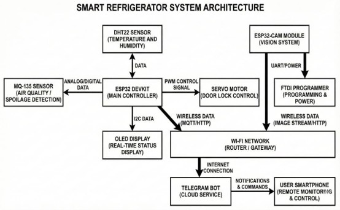

\# 🧊 Smart Refrigerator Monitoring System Using IoT


<p align="center">


!\[Language](https://img.shields.io/badge/Language-Arduino%20C-blue?style=for-the-badge)

!\[Platform](https://img.shields.io/badge/Platform-ESP32-green?style=for-the-badge)

!\[IoT](https://img.shields.io/badge/Technology-IoT-orange?style=for-the-badge)

!\[Status](https://img.shields.io/badge/Status-Completed-brightgreen?style=for-the-badge)


</p>


\---


\# 📖 Overview


The \*\*Smart Refrigerator Monitoring System Using IoT\*\* is an ESP32-based smart refrigerator designed to monitor food storage conditions in real time. It continuously measures \*\*temperature\*\*, \*\*humidity\*\*, and \*\*air quality\*\*, displays the readings on an OLED display, captures images using an ESP32-CAM, and sends notifications through a Telegram Bot.


The system also provides \*\*food expiry management\*\*, allowing users to add, delete, and monitor food items remotely.


\---


\# ✨ Features


\- 🌡 Real-time Temperature Monitoring

\- 💧 Humidity Monitoring

\- 🌫 Air Quality Monitoring using MQ-135

\- 📺 OLED Display for Live Status

\- 📷 ESP32-CAM Image Capture

\- 🤖 Telegram Bot Integration

\- 🍎 Food Expiry Management

\- 🔒 Servo-based Door Lock Control

\- 📲 Remote Monitoring via Wi-Fi

\- ⚡ ESP32 Based IoT System


\---


\# 🛠 Hardware Components


| Component | Description |

|------------|-------------|

| ESP32 DevKit | Main Controller |

| ESP32-CAM | Image Capture |

| DHT22 | Temperature \& Humidity Sensor |

| MQ-135 | Air Quality Sensor |

| OLED Display | Live Status Display |

| Servo Motor | Door Lock Mechanism |

| FTDI Programmer | ESP32-CAM Programming |


\---


\# 💻 Software Used


\- Arduino IDE

\- Embedded C

\- ESP32 Board Package

\- Telegram Bot API

\- Wi-Fi Library

\- Adafruit SSD1306 Library

\- DHT Sensor Library


\---


\# ⚙ Working Principle


1\. ESP32 reads Temperature and Humidity from DHT22.

2\. MQ-135 monitors refrigerator air quality.

3\. OLED continuously displays sensor readings.

4\. Telegram Bot provides remote access to sensor values.

5\. Users can add and delete food items using Telegram.

6\. ESP32-CAM captures refrigerator images.

7\. Servo motor controls the refrigerator lock.

8\. Notifications are sent whenever abnormal conditions are detected.


\---


\# 📂 Project Structure


```

Refrigerator\_Monitoring\_Using\_IoT

│

├── Refrigerator\_Monitoring\_Using\_IoT.ino

├── README.md

└── IMAGES

&#x20;   ├── Architecture.jpg

&#x20;   ├── Block\_Diagram.jpg

&#x20;   ├── Circuit\_Diagram.jpg

&#x20;   ├── Flow\_Chart.jpg

&#x20;   ├── DHT22\_Result.jpg

&#x20;   ├── MQ-135\_Result.jpg

&#x20;   ├── OLED\_Result.jpg

&#x20;   ├── ESP32-CAM\_Result.jpg

&#x20;   ├── Servo\_Result.jpg

&#x20;   ├── Food\_Management1.jpg

&#x20;   └── Food\_Management2.jpg

```


\---


\# 🏗 System Architecture


<p align="center">



</p>


\---


\# 📋 Block Diagram


<p align="center">


</p>


\---


\# 🔌 Circuit Diagram


<p align="center">


</p>


\---


\# 🔄 Flow Chart


<p align="center">


</p>


\---


\# 📸 Project Results


\## OLED Display


<p align="center">


</p>


\---


\## Temperature \& Humidity Monitoring


<p align="center">


</p>


\---


\## Air Quality Monitoring


<p align="center">


</p>


\---


\## ESP32-CAM Output


<p align="center">


</p>


\---


\## Servo Door Lock


<p align="center">


</p>


\---


\## Food Management


<p align="center">


</p>


\---


\# 🚀 How to Run


1\. Install Arduino IDE.

2\. Install ESP32 Board Package.

3\. Install required libraries.

4\. Open `Refrigerator\_Monitoring\_Using\_IoT.ino`.

5\. Configure Wi-Fi credentials.

6\. Add Telegram Bot Token and Chat ID.

7\. Upload the code to ESP32.

8\. Power the hardware and monitor readings.


\---


\# 📚 Libraries Used


\- WiFi.h

\- WiFiClientSecure.h

\- UniversalTelegramBot.h

\- ArduinoJson.h

\- DHT.h

\- Wire.h

\- Adafruit\_GFX.h

\- Adafruit\_SSD1306.h

\- ESP32Servo.h


\---


\# 🎯 Future Enhancements


\- Mobile Application

\- Cloud Database Integration

\- Voice Assistant Support

\- AI-based Food Recognition

\- Automatic Grocery Ordering


\---


\# 👨‍💻 Author


\*\*Rajath H M\*\*


\*\*Electronics and Communication Engineering\*\*


\---


⭐ If you found this project useful, consider giving it a \*\*Star\*\* on GitHub.

