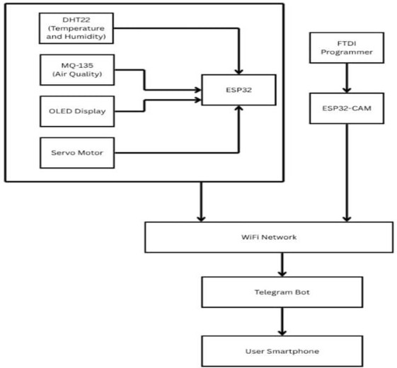
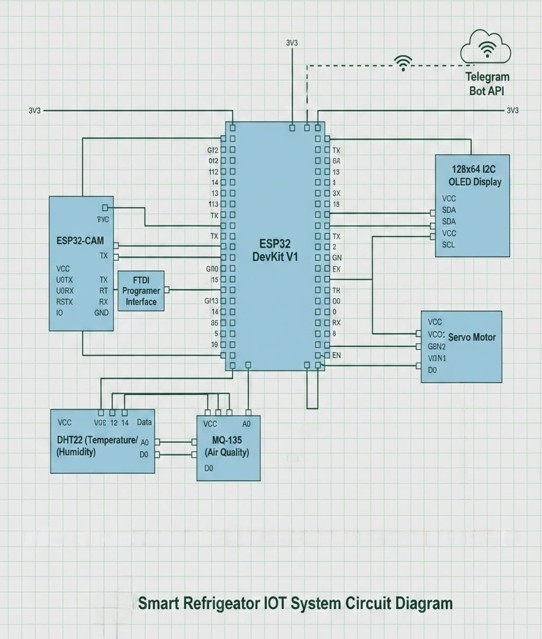
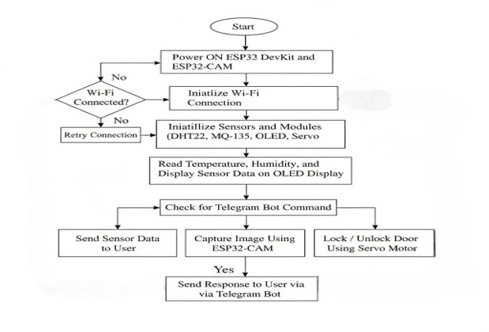
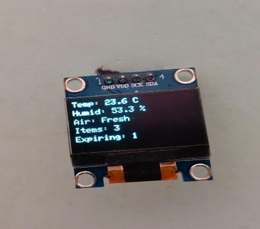
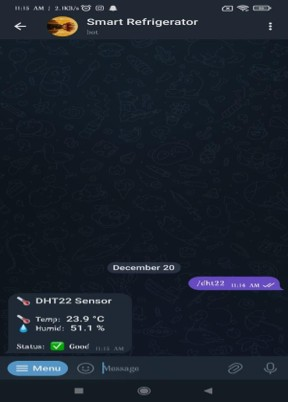
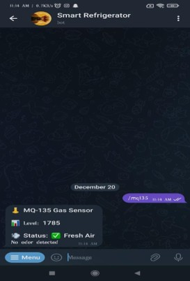
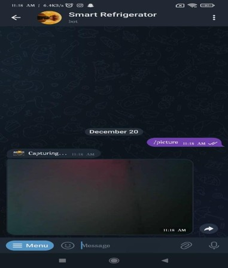
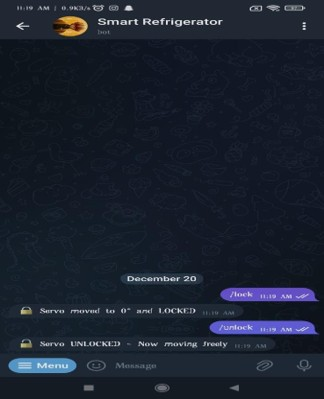
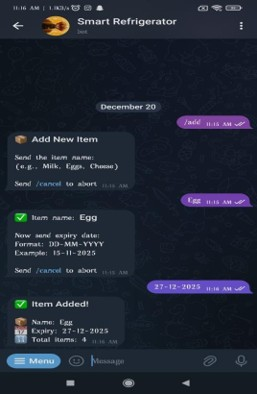
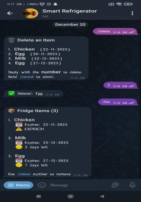

 🧊 Smart Refrigerator Monitoring System Using IoT

<p align="center">
  
  
  
  
</p>

---

 📖 Overview

The **Smart Refrigerator Monitoring System Using IoT** is an ESP32-based smart refrigerator that continuously monitors temperature, humidity, and air quality. The system also captures refrigerator images using an ESP32-CAM module and allows remote monitoring through a Telegram Bot.

Users can monitor sensor readings, receive alerts, and manage food items with expiry dates directly from Telegram.

---

 ✨ Features

- 🌡 Real-time Temperature Monitoring
- 💧 Humidity Monitoring
- 🌫 Air Quality Detection using MQ-135
- 📺 OLED Live Status Display
- 📷 ESP32-CAM Image Capture
- 🤖 Telegram Bot Integration
- 🍎 Food Expiry Management
- 🔒 Servo Motor Door Lock
- 📡 Wi-Fi Based Remote Monitoring

---

 🔧 Hardware Components

| Component | Purpose |
|-----------|---------|
| ESP32 DevKit | Main Controller |
| ESP32-CAM | Image Capture |
| DHT22 | Temperature & Humidity Sensor |
| MQ-135 | Air Quality Sensor |
| OLED Display | Display Live Status |
| Servo Motor | Door Lock Control |
| FTDI Programmer | ESP32-CAM Programming |

---

 💻 Software Used

- Arduino IDE
- Embedded C
- ESP32 Board Package
- Telegram Bot API
- WiFi Library

---

 ⚙ Working Principle

1. ESP32 reads temperature and humidity from DHT22.
2. MQ-135 detects refrigerator air quality.
3. OLED displays sensor values in real time.
4. ESP32-CAM captures refrigerator images.
5. Telegram Bot provides remote monitoring.
6. Users can add and delete food items.
7. Servo motor controls refrigerator lock.
8. Alerts are sent when abnormal conditions occur.

---

 📂 Project Structure

```text
Refrigerator_Monitoring_Using_IoT
│
├── Refrigerator_Monitoring_Using_IoT.ino
├── README.md
└── IMAGES
    ├── Architecture.jpg
    ├── Block_Diagram.jpg
    ├── Circuit_Diagram.jpg
    ├── Flow_Chart.jpg
    ├── OLED_Result.jpg
    ├── DHT22_Result.jpg
    ├── MQ-135_Result.jpg
    ├── ESP32-CAM_Result.jpg
    ├── Servo_Result.jpg
    ├── Food_Management1.jpg
    └── Food_Management2.jpg
```

---

 🏗 System Architecture

<p align="center">

</p>

---

 📋 Block Diagram

<p align="center">

</p>

---

 🔌 Circuit Diagram

<p align="center">

</p>

---

 🔄 Flow Chart

<p align="center">

</p>

---

 📸 Project Results

 OLED Display

<p align="center">

</p>

---

 Temperature & Humidity

<p align="center">

</p>

---

 Air Quality Monitoring

<p align="center">

</p>

---

 ESP32-CAM Output

<p align="center">

</p>

---

 Servo Door Lock

<p align="center">

</p>

---

 Food Management

<p align="center">


</p>

---

 🚀 How to Run

1. Install Arduino IDE.
2. Install ESP32 Board Package.
3. Install all required libraries.
4. Open `Refrigerator_Monitoring_Using_IoT.ino`.
5. Configure Wi-Fi SSID and Password.
6. Configure Telegram Bot Token and Chat ID.
7. Select ESP32 Board.
8. Upload the program.
9. Monitor the output using Telegram and OLED display.

---

 📚 Libraries Used

- WiFi.h
- WiFiClientSecure.h
- UniversalTelegramBot.h
- ArduinoJson.h
- DHT.h
- Wire.h
- Adafruit_GFX.h
- Adafruit_SSD1306.h
- ESP32Servo.h

---

🚀 Future Enhancements

- 📱 Mobile Application
- ☁ Cloud Database Integration
- 🎙 Voice Assistant Support
- 🤖 AI-based Food Recognition
- 🛒 Automatic Grocery Ordering

---

👨‍💻 Author

Rajath H M
B.E. Electronics and Communication Engineering

---
⭐ If you found this project useful, consider giving it a **Star** on GitHub.
